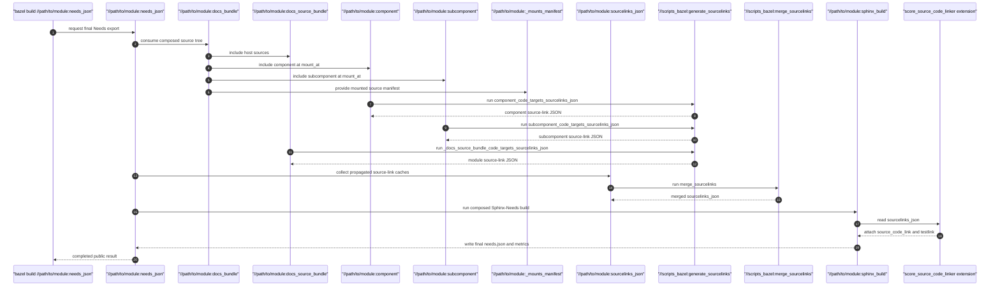
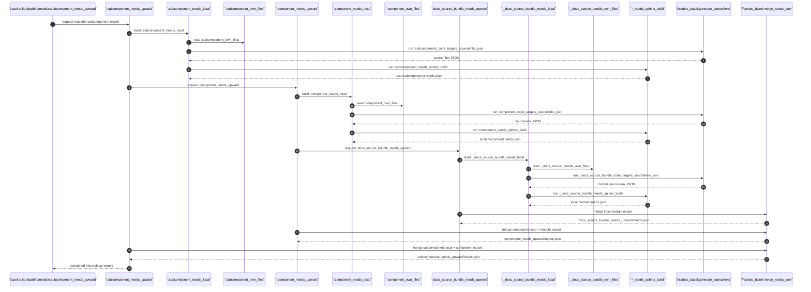

<!--
  *******************************************************************************
  Copyright (c) 2026 Contributors to the Eclipse Foundation

  See the NOTICE file(s) distributed with this work for additional
  information regarding copyright ownership.

  This program and the accompanying materials are made available under the
  terms of the Apache License Version 2.0 which is available at
  https://www.apache.org/licenses/LICENSE-2.0

  SPDX-License-Identifier: Apache-2.0
  *******************************************************************************
-->

# Hierarchically linked bundle Needs exports

This document defines how reusable documentation bundles own Needs, how those
Needs may refer to a higher architectural level, and how the individual
bundle results are combined into the public `needs_json` result.

The design separates two relationships that are easy to conflate:

* `bundles` describes which documentation sources are composed into a source
  tree and where they are mounted.
* `upward_bundles` describes which Needs from a higher level are available to
  a bundle while its own Needs are processed.

The first relationship is about documentation composition. The second is
about Needs ownership and validation. Neither relationship is inferred from
the other.

## Problem and rationale

The existing `needs_json` build runs Sphinx-Needs over the complete composed
documentation tree. A mounted bundle is therefore processed together with the
host documentation and all other mounted bundles. This has two important
consequences:

1. A change in one bundle invalidates the complete Needs action.
2. A Need is evaluated only after all source trees have been rebased to their
   final mount locations.

The second property is useful for the final documentation result, but it is
too coarse for reusable bundles. A bundle must be able to validate and cache
the Needs it owns without taking ownership of all sources mounted below it.
At the same time, a lower-level Need must be able to refer to a Need owned by
an explicitly selected higher-level bundle.

The solution is to process a bundle's own sources separately and to exchange
Needs through an explicit upward interface. A final composition step still
builds the complete graph, so the public result retains global backlinks,
constraints, metrics, and final document paths.

## Bundle model

A `docs_bundle` is a named documentation component. It can contain its own
source directory, data, source-code links, a metamodel, and nested bundles.
The presence of nested sources does not change who owns their Needs: each
source-bearing bundle owns the Needs created from its own sources.

There are three relevant kinds of bundle:

* A **source bundle** has a `source_dir` and owns the Needs extracted from
  those sources.
* A **composed bundle** has nested `bundles`. It exposes one combined source
  tree to its consumer, but it does not take ownership of the child bundles'
  Needs.
* A **hierarchy group** may have no sources at all and may still declare
  `upward_bundles`. It is a named Bazel node for reusing a hierarchy
  relationship; because it has no sources, it owns no local Needs.

The same `docs_bundle` target can be both a source bundle and a composed
bundle. These terms describe its two independent roles, not different rule
types.

### Composition and hierarchy are different graphs

| Concern | Bazel attribute | Direction | Meaning |
| --- | --- | --- | --- |
| Documentation composition | `bundles` | Downwards | Include a child source tree and rebase it below `mount_at`. |
| Needs hierarchy | `upward_bundles` | Upwards | Make Needs owned by an ancestor available as an input. |

`bundles` controls files, document placement, attachments, data, and source
links. `upward_bundles` controls the permitted Needs interface. For example,
mounting `engine_bundle` below `powertrain` does not by itself allow engine
Needs to link to powertrain Needs. That permission is granted by the explicit
`upward_bundles = [":powertrain_bundle"]` declaration.

This distinction is important for Bazel analysis. A source tree can be
composed downwards while a Needs export depends upwards, without making the
bundle responsible for all of the sources visible in the final tree.

## User-facing declaration

A normal reusable bundle does not need a hierarchy declaration. A bundle that
has Needs links to a higher level names the allowed ancestors explicitly:

```starlark
load("//:docs.bzl", "docs", "docs_bundle")

# A normal reusable bundle. It owns its own Needs and has no upward interface.
docs_bundle(
    name = "guidance_bundle",
    source_dir = "guidance/docs",
)

# Needs owned by this bundle are available to lower-level bundles that name it.
docs_bundle(
    name = "powertrain_bundle",
    source_dir = "powertrain/docs",
)

# This bundle may link its Needs to powertrain_bundle or to one of its
# declared ancestors. The dependency is explicit in the Bazel graph.
docs_bundle(
    name = "engine_bundle",
    source_dir = "engine/docs",
    upward_bundles = [":powertrain_bundle"],
)

# A source-less named hierarchy group is also valid. It owns no local Needs.
docs_bundle(
    name = "vehicle_architecture_group",
    upward_bundles = [":powertrain_bundle"],
)

docs(
    source_dir = "docs",
    bundles = [
        {
            "bundle": ":guidance_bundle",
            "mount_at": "guidance",
        },
        {
            "bundle": ":engine_bundle",
            "mount_at": "powertrain/engine",
        },
    ],
)
```

An upward declaration grants access to the direct target and its transitive
upward closure. The bundle's ``*_needs_local`` export contains only Needs
created from the bundle's own sources. Its ``*_needs_upward`` export is the
reusable interface view: it merges that local export with the exports of the
declared ancestors. The imported ancestor records remain owned by their
original source bundles; aggregating them does not transfer ownership to the
declaring bundle.

The dependency is deliberately declared in Bazel rather than inferred from
Need links. This makes the allowed interface visible during analysis,
provides the inputs needed for caching, and prevents accidental links to
siblings, descendants, or unrelated bundles.

## The two bundle views created by `docs()`

`docs()` has two different consumers: hierarchy-aware Needs processing and the
normal composed documentation build. They need different views of the host
documentation.

Internally, the macro therefore creates:

```text
host sources --------------------> :docs_source_bundle
                                          |
                                          | composed with mounted children
                                          v
host source bundle + child bundles -> :docs_bundle
                                          |
                                          +-> Sphinx documentation build
                                          +-> docs_check
                                          +-> public needs_json
```

`:docs_source_bundle` contains only the host's own sources, data, source-code
links, and metamodel. It is the source-level node of the host in the bundle
graph and is available as an upward hierarchy anchor. The public
`:docs_bundle` is an aggregator containing that source node and all bundles
passed to `docs(bundles = ...)`.

This separation prevents a dependency cycle. A lower-level bundle can depend
on the own-source export of an ancestor, while the ancestor's composed source
tree can include the lower-level bundle:

```text
child Needs export  ----depends upwards---->  parent own-source export
parent composed tree <----mounts downwards---- child source bundle
```

The documentation tree can consequently express parent/child relationships
without making the Bazel dependency graph cyclic. `:docs_source_bundle` is the
stable public source-anchor label for cross-package consumers. The historical
`:_docs_source_bundle` label remains available for compatibility. Users
configure the host through `docs()` and reusable components through
`docs_bundle()`.

## Needs ownership and bundle exports

The unit of Needs ownership is a source bundle, not a mount point. Mounting the
same bundle at another location changes the document path at which its Needs
are rendered, but it does not create a second owner or a second Need ID.

A bundle-local ``*_needs_local`` export contains:

* Needs created from the bundle's own documentation sources;
* the bundle-relative `docname` and source location;
* the bundle's ownership/origin information;
* Need parts, link conditions, and other data needed for later validation;
* source-link information belonging to the bundle; and
* the selected metamodel context.

The corresponding ``*_needs_upward`` export additionally contains the Needs
from the direct ``upward_bundles`` exports. Those exports already contain their
own upward closure, so the result exposes the complete declared interface to a
downstream consumer. Imported records remain distinguishable as ancestor
records and are not owned by the child bundle.

Need IDs are the stable cross-bundle identity. A bundle-relative `docname` is
not stable across mounts: the final path is determined by the consumer's
`mount_at`. This is why links between bundles use Need identity while the
top-level composition is responsible for final document paths and generated
URLs.

### Direct and transitive upward dependencies

The direct declaration and its closure have distinct meanings:

* `direct_upward_bundles` is the set written in the current rule's
  `upward_bundles` attribute.
* `upward_bundles` is the transitive set consisting of those direct targets
  and the upward closure exported by each target.

The closure is the complete validation interface of the bundle. If `engine`
declares `powertrain`, and `powertrain` declares `vehicle`, engine can use
Needs from both `powertrain` and `vehicle`. It does not need to repeat the
transitive declaration, and a consumer can still inspect which edge was
declared directly.

## Processing model

## Execution traces

The two entry points below deliberately show different Bazel paths. The public
module ``needs_json`` target consumes the complete composed source tree. The
bundle-local export targets are a separate, cacheable path used when a bundle
is consumed through ``upward_bundles``.

### Trigger from the module's public ``needs_json`` target

The module-level build traverses the downward ``bundles`` composition and runs
one final Sphinx-Needs build. It does not invoke the intermediate
``*_needs_local`` or ``*_needs_upward`` targets. If ``code_targets`` are
configured, each source bundle first produces its source-link cache; the
public ``sourcelinks_json`` target then merges those caches before Sphinx
consumes them.



The diagram shows the ``code_targets`` path: ``component_code_targets_sourcelinks_json``
and its siblings invoke ``//scripts_bazel:generate_sourcelinks``. Without
``code_targets``, the corresponding bundle-local Needs action uses an empty
``*_needs_sourcelinks_json`` target instead.

### Trigger from the subcomponent's upward export

When the requested target is ``subcomponent_needs_upward``, Bazel follows the
Needs hierarchy in the opposite semantic direction: the subcomponent builds
its own local export and requests the component export; the component in turn
requests the module's private own-source export. Each level runs its own
Sphinx-Needs action and then ``merge_needs_json`` adds the local result to the
already merged parent export.



The sequence is shown in dependency order for readability. Bazel may build
independent prerequisites in parallel: the subcomponent's local export does
not depend on the component export. The component export itself waits for the
module's own-source export because ``upward_bundles`` is an explicit
dependency. The source-code linker path is shown at every level; if a level
does not configure ``code_targets``, its empty ``*_needs_sourcelinks_json``
target replaces the generated source-link cache.

### Bundle-local processing

The bundle-local action receives the source bundle's own sources and its
metamodel. It also receives the exports of the bundle's upward closure. The
Sphinx-Needs run can therefore resolve:

* Needs defined in the current bundle; and
* Needs defined by a declared upward bundle or one of its ancestors.

The bundle-local action does not see sibling or descendant exports through
this interface. A link outside the local ownership set and the declared
upward closure is invalid because the bundle has no declared dependency on
the target's ownership context.

The result is an internal artifact. Its records remain relative to the
bundle's own source tree, because no consumer has assigned a mount path yet.

### Top-level composition

The public `needs_json` action consumes the complete source tree exposed by the
composed documentation bundle and applies the placements from `bundles`. It
does not depend on the intermediate ``*_needs_local`` or ``*_needs_upward``
artifacts. It then performs the operations whose meaning depends on the
complete graph:

* rebase each bundle-relative `docname` to its final `mount_at` path;
* resolve links and calculate backlinks over all imported Needs;
* evaluate global constraints and dead-link state;
* calculate metrics and traceability gates; and
* write the existing public `needs_json` output.

This step is the final graph view, not a second ownership layer. It evaluates
the records from all composed source owners in one Sphinx run; it does not
copy a parent's Needs into a child or recreate HTML from an intermediate
export. The ``*_needs_upward`` artifacts are the separate reusable interface
shown in the second sequence diagram.

Rendering, navigation, `:doc:`/`:ref:` resolution, includes, images, and
other source-tree behavior continue to use the complete composed Sphinx source
tree. `docs_check` remains the document-level integration check for that tree.

## Metamodel and ownership context

The metamodel belongs to the bundle that owns the Needs. It is selected on
`docs_bundle(metamodel = ...)`, defaults to the built-in SCORE metamodel, and
is propagated in `DocsBundleInfo`.

Selecting the metamodel per bundle has two reasons:

1. A reusable bundle must be analyzable with the schema that defines its own
   Need types and fields.
2. The metamodel is an input to the bundle-local action, so changing it must
   invalidate that bundle's result rather than an unrelated bundle.

The final composition retains the origin of each Need separately from its
rendered location. A bundle from another module may be mounted into the local
documentation tree while remaining foreign for ownership-sensitive metrics
and release gates. URL placement and ownership are therefore not represented
by a single boolean such as `is_external`.

## Bazel representation

`DocsBundleInfo` carries the metadata needed by both composition and
hierarchy-aware processing:

* source entries with their eventual mount metadata;
* source-code links, data, and external runfiles;
* the selected metamodel;
* the directly declared upward bundle targets; and
* a deduplicated depset containing the direct targets and their transitive
  upward closure.

The closure is calculated while analyzing a bundle:

```text
upward closure(current) = direct(current)
                       + union(upward closure(parent))
```

Using a Bazel depset makes the interface transitive, deduplicated, and
available to downstream rules without requiring each rule to rediscover the
hierarchy. The same provider is present on source bundles, composed bundles,
and source-less hierarchy groups. A composed bundle aggregates source entries
for file placement, but its upward interface remains a separate piece of
metadata.

## Invariants

The architecture relies on the following invariants:

* A Need has exactly one owning source bundle.
* `bundles` does not transfer Need ownership.
* `upward_bundles` is explicit and is the only cross-bundle validation
  interface.
* A bundle's ``*_needs_local`` export contains its own Needs; its
  ``*_needs_upward`` export may aggregate imported ancestor Needs without
  transferring ownership.
* Need IDs remain stable when a bundle is mounted at another path.
* Final document paths, backlinks, and global checks are computed only after
  composition has assigned mount locations.
* The Bazel dependency graph remains acyclic even though documentation
  composition and Needs references describe opposite semantic directions.
* The public `needs_json` shape and existing consumer commands remain
  compatible with the composed result.

These invariants are the reason the implementation keeps the private host
source bundle separate from the public composed `docs_bundle` and propagates
both direct and transitive upward dependencies.
