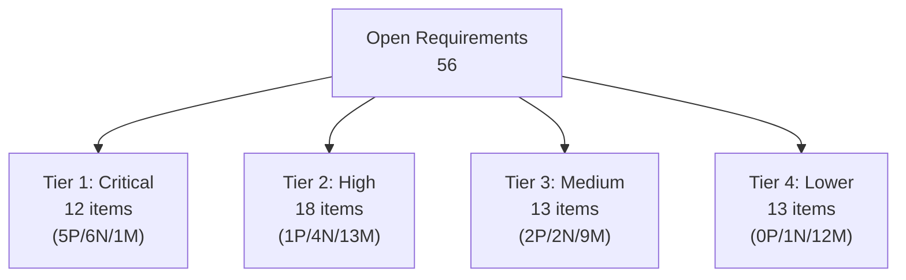

# SCORE #1782 Open Items in docs-as-code

Source reference: https://github.com/eclipse-score/score/issues/1782#issuecomment-4108721585

Note: the referenced comment currently contains only "for review on Mar-30". The checklist was taken from the issue body of `eclipse-score/score#1782`.

**Context**: docs-as-code platform development supporting ASIL B project certification per SCORE building blocks metamodel.
- **Platform Purpose**: Enable downstream ASIL B projects (Dependable Elements) to produce certified safety documentation
- **Module Requirements**: ALL modules in docs-as-code must enforce ASIL B-level rigor (change management, safety analysis) regardless of their own ASIL assignment, because consuming projects may be ASIL B
- **Assumptions of Use (AoU)**: Platform documents AoU that modules must respect; consuming projects document their own AoU for end customers
- **Implication**: The 56 open items represent ASIL B-level requirements for the platform and all its modules, enabling downstream ASIL B certification

## Summary

- Total requirements in list: **97** (ALL apply to platform + all modules to enable ASIL B project certification)
- Open in docs-as-code: **56** (Tier 1 & 2 have no ASIL-dependent scope; ALL modules must implement)
  - PARTIAL: **8**
  - NO: **13**
  - NOT_MAPPED: **35**

State legend:
- `PARTIAL`: mapped to docs-as-code requirement(s) with `:implemented: PARTIAL`
- `NO`: mapped to docs-as-code requirement(s) with `:implemented: NO`
- `NOT_MAPPED`: no mapping found in `docs/internals/requirements/requirements.rst`

PM title source: `process_description` requirement titles (`.. gd_req:: ...`), with fallback to first requirement sentence.

## Functional Safety Prioritization

The open items are organized by **Safety Tier** to highlight the critical path for **ASIL B-capable platform** development per SCORE building blocks:

- **Tier 1 (Critical)**: Direct blockers for ASIL B platform certification. Required for all modules to ensure consuming ASIL B projects can rely on platform support (safety analysis, requirements traceability, test coverage).
- **Tier 2 (High)**: Essential ASIL B infrastructure for all modules. Change control, problem management, document governance—mandatory for all modules to ensure downstream ASIL B projects meet certification audit requirements.
- **Tier 3 (Medium)**: Platform robustness and traceability depth. Important for mature ASIL B processes. All modules expected to implement.
- **Tier 4 (Lower)**: Extended capabilities or language-specific conveniences. Platform and modules can use alternative approaches where core Tier 1-2 requirements are met.

## Epic Diagram

## Tier 1: Critical Requirements (12 items)

**Category**: Direct enablers for ASIL B-capable platform. ALL modules must implement these to ensure consuming ASIL B projects receive proper safety analysis infrastructure. Non-negotiable for downstream ASIL B certification.

### Safety Analysis Automation (8/13 open)

| ID | Title | Description | Safety Relevance | State | Mapped Tool Req |
|---|---|---|---|---|---|
| gd_req__saf_attr_mitigated_by | Mitigation Controls Documentation | Documents which design controls or safety mechanisms mitigate identified hazards and risks. Links failures to their mitigation strategies. | **CRITICAL (ASIL B)**: ALL modules must document mitigations for identified failures. Consuming projects need proof that platform is safe for ASIL B integration. Auditors verify: every failure mode has documented mitigation linked to requirements and tests. | NO | tool_req__docs_saf_attrs_mitigated_by |
| gd_req__saf_attr_aou | Applicability to Area of Use (AOU) Linkage | Explicitly links safety analysis artifacts (FMEA, DFA) to the specific operational context, vehicles, or systems they apply to. | **CRITICAL (ASIL B)**: ALL modules must declare their AoU scope. Analysis must explicitly state: "all releases" or "specific constraints". Consuming ASIL B projects need to know: which module AoU assumptions must they respect? Missing AoU scope = audit finding. | NO | tool_req__docs_saf_attrs_mitigated_by |
| gd_req__saf_attr_requirements_check | Safety Analysis–Requirements Linkage Validation | Automated checks ensuring every hazard/failure identified in safety analysis has corresponding requirements to control it. Detects orphaned risks. | **CRITICAL (ASIL B)**: ALL modules must have every failure mode linked to a requirement. Orphaned failure modes = audit failure for consuming ASIL B projects. Automated checks prevent gaps. Non-negotiable. | NO | tool_req__docs_saf_attrs_mitigated_by |
| gd_req__saf_linkage_check | Safety Analysis Linkage Consistency | Validates that links between FMEA/DFA items, requirements, and tests are consistent and bidirectional. Detects dangling references. | **CRITICAL (ASIL B)**: ALL modules must have complete bidirectional traceability. Broken links = missing evidence for ASIL B projects. Automatic checking prevents audit failure. Non-negotiable. | NO | tool_req__docs_saf_attrs_violates |
| gd_req__saf_attr_feffect | Failure Effect Documentation | Precisely documents what happens when a failure occurs (loss of function, unintended behavior, delayed response, etc.). Critical for risk assessment. | **CRITICAL (ASIL B)**: ALL modules must classify failure effects per ISO 26262 Table 1. Vague effects = ASIL downgrade for consuming projects = audit failure. Mandatory precision required. | NO | tool_req__docs_saf_attr_fmea_failure_effect |
| gd_req__saf_attr_fault_id | FMEA Fault/Failure Mode Identity | Unique identifier for each failure mode in FMEA ensuring no duplicates or overlooked scenarios. Enables consistent reference in all downstream artifacts. | **CRITICAL (ASIL B)**: ALL modules must have unique FMEA IDs. Consuming ASIL B projects need traceable audit trail: which failures analyzed, which requirements address them, which tests verify. No exceptions. | NO | tool_req__docs_saf_attr_fmea_fault_id |
| gd_req__saf_attr_failure_id | DFA Failure Point Identity | Unique identifier for each failure point in Dependent Failure Analysis. Critical for complex systems with interdependent components. | **CRITICAL (ASIL B)**: ALL modules with complex interdependencies must have DFA with unique failure point IDs. Missing IDs = unanalyzed cascades for ASIL B projects = audit failure. Required for complex architectures. | NO | tool_req__docs_saf_attr_dfa_failure_id |
| gd_req__saf_argument | Safety Analysis Argumentation | Rationale and supporting evidence explaining why identified hazards are or are not significant, why ASIL assignments are appropriate, why mitigations are sufficient. | **CRITICAL (ASIL B)**: ALL modules must document safety arguments supporting their analysis. Consuming ASIL B projects rely on this. Auditors scrutinize: why is module safe? Why are mitigations sufficient? Unsupported = non-compliance. | NO | tool_req__docs_saf_attrs_content |

### Requirements Traceability (4/7 open)

| ID | Title | Description | Safety Relevance | State | Mapped Tool Req |
|---|---|---|---|---|---|
| gd_req__req_linkage | Requirement Cross-Linking | Establishes relationships between requirements (implements, refines, conflicts with, depends-on). Creates the requirement dependency graph. | **CRITICAL (ASIL B)**: ALL modules must show requirement relationships and dependencies. Consuming ASIL B projects need impact analysis: "if this module's requirement changes, what else breaks?" | PARTIAL | tool_req__docs_req_link_satisfies_allowed |
| gd_req__req_traceability | End-to-End Traceability Matrix | Links requirements → design → tests → verification results in a bidirectional chain auditable for completeness and consistency. The "traceability matrix" auditors demand. | **CRITICAL (ASIL B)**: ALL modules must provide complete V-model traceability: requirements → design → tests → results. Consuming ASIL B projects depend on this. Missing links = audit failure. | PARTIAL | tool_req__docs_req_link_satisfies_allowed |
| gd_req__req_attr_test_covered | Test Coverage Completeness Validation | Automated checks ensuring every safety requirement has at least one test case assigned and executed. Detects untested requirements. | **CRITICAL (ASIL B)**: ALL modules must have 100% test coverage of safety requirements. No untested requirements allowed. Consuming ASIL B projects require complete evidence. Automated check mandatory. | PARTIAL | tool_req__docs_req_attr_testcov |
| gd_req__req_attr_req_cov | Requirement Coverage Scope | Tracks which architecture/design items satisfy which requirements, preventing ambiguity about requirement implementation. | **CRITICAL (ASIL B)**: ALL modules must map requirements to architecture/design elements. Consuming ASIL B projects need proof: requirements are actually implemented, not just documented. Without mapping, unproven. | PARTIAL | tool_req__docs_req_attr_reqcov |

### Configuration Management (1/1 open)

| ID | Title | Description | Safety Relevance | State | Mapped Tool Req |
|---|---|---|---|---|---|
| gd_req__configuration_uid | Configuration Unique Identification | Every configuration/release of the documented system must have a unique, immutable ID enabling audit trail and traceability to specific configuration versions. | **CRITICAL (ASIL B)**: ALL module configurations must be uniquely versioned. Consuming ASIL B projects must answer: "which module version was integrated?" Broken traceability = audit failure. | NOT_MAPPED | - |

---

## Tier 2: High-Priority Requirements (18 items)

**Category**: Essential ASIL B infrastructure. ALL modules require change control, problem management, document governance—mandatory for consuming ASIL B projects to meet certification audit requirements.

### Change & Problem Management (13/18 open)

| ID | Title | Description | Safety Relevance | State | Mapped Tool Req |
|---|---|---|---|---|---|
| gd_req__change_attr_uid | Change Request Unique ID | Every change to safety-relevant artifacts must have a unique tracking ID enabling full audit trail and impact analysis. | **HIGH (ASIL B)**: ALL modules must track every change with unique IDs. Consuming ASIL B projects need audit trail. Untracked changes = certification violation. Mandatory for all. | NOT_MAPPED | - |
| gd_req__change_attr_title | Change Request Title | Descriptive title enabling quick identification of what is being changed and why. Critical for impact assessment. | **HIGH (ASIL B)**: ALL modules require clear change titles. Consuming ASIL B projects need rapid safety impact assessment. Required for all. | NO | tool_req__docs_doc_attr |
| gd_req__change_attr_status | Change Request Status Tracking | Workflow state (proposed, reviewed, approved, implemented, verified, released) ensuring changes are properly authorized before implementation. | **HIGH (ASIL B)**: ALL modules require controlled workflow: proposed→assessment→review→approved→tested→released. Consuming ASIL B projects need workflow enforcement. Mandatory. | NOT_MAPPED | - |
| gd_req__change_attr_safety | Change Request Safety Impact Assessment | Explicit field documenting whether change affects safety requirements, analysis, or test coverage and what the impact is. | **HIGH (ASIL B)**: ALL modules must assess safety impact of every change. Mandatory assessment prevents undetected impact. Consuming ASIL B projects require this. | PARTIAL | tool_req__docs_doc_generic_mandatory |
| gd_req__change_attr_types | Change Request Categories | Classification (defect fix, enhancement, safety-critical change, design change, etc.) enabling routing to appropriate review process. | **HIGH**: Safety-critical changes require more scrutiny. Misclassification routes safety change through standard process, missing specialized review. | NOT_MAPPED | - |
| gd_req__change_attr_milestone | Change Request Scheduling | Links change to project timeline/release version. Enables tracking: "which changes are in which release?" Critical for coordinating safety analysis updates. | **HIGH**: When coordinating platform safety analysis with product releases, need to know which changes are in which build. Without this, mismatch between analyzed platform ≠ delivered platform. | NOT_MAPPED | - |
| gd_req__change_attr_impact_description | Change Impact Description | Documents *why* a change is needed and what it affects (requirements, architecture, tests, risk profile). Enables informed review. | **HIGH**: Safety reviewers need context. "Changed line 42 of module X" is meaningless without explanation. Clear impact descriptions enable proper safety assessment. | NOT_MAPPED | - |
| gd_req__problem_attr_uid | Problem Report Unique ID | Every identified problem/defect must have unique ID enabling audit trail and traceability to fix/verification. | **HIGH**: If a safety-critical defect is discovered, must prove it was tracked, analyzed for safety impact, fixed, and verified. Missing ID = untracked problem. | NOT_MAPPED | - |
| gd_req__problem_attr_title | Problem Report Title | Clear description of what is wrong enabling quick identification and assessment. | **HIGH**: Safety staff need to assess: "does this defect affect safety?" Unclear titles delay assessment and risk safety impact being missed. | NOT_MAPPED | - |
| gd_req__problem_attr_status | Problem Report Status | Workflow ensuring problems are investigated, root-caused, fixed, and verified before closing. Prevents unresolved issues. | **HIGH**: Incomplete problem closure = unresolved defect potentially affecting safety. Status tracking ensures rigor in problem resolution. | NOT_MAPPED | - |
| gd_req__problem_attr_classification | Problem Classification | Type (functional defect, safety issue, performance, integration problem, etc.) routing to appropriate resolution process. | **HIGH**: Safety-critical problems require different root cause analysis and verification. Misclassification sends safety defect through standard defect process. | NOT_MAPPED | - |
| gd_req__problem_attr_safety_affected | Problem Safety Impact | Explicit assessment: does this problem affect safety? If yes, what is the impact and required fix/verification? | **HIGH (ASIL B)**: ALL modules must assess every problem for safety impact. No exceptions. Consuming ASIL B projects require complete assessment. Unassessed defects = unmanaged risk. | NOT_MAPPED | - |
| gd_req__problem_check_closing | Problem Resolution Verification | Checks ensuring a problem cannot be marked "closed" without evidence it was actually fixed and verified. Prevents premature closure. | **HIGH**: Prevents "closed" problems that actually still exist. Broken verification = defect re-appears in production. | NOT_MAPPED | - |
| gd_req__problem_attr_anaylsis_results | Problem Root Cause Analysis | Documented investigation of why the problem occurred, enabling preventive action. Without root cause, same problem re-occurs. | **HIGH**: Superficial fixes (symptom treatment) without root cause analysis = defect will recur. Proper root cause identification prevents repeated safety issues. | NOT_MAPPED | - |
| gd_req__problem_attr_impact_description | Problem Impact Description | Clear documentation of scope (what is broken, how many users/products affected, severity). Enables triage and risk assessment. | **HIGH**: Without impact scope, cannot assess urgency or safety relevance. Small problem affecting 1 user ≠ widespread problem affecting all safety-critical units. | NOT_MAPPED | - |
| gd_req__problem_attr_milestone | Problem Fix Scheduling | Links problem to planned resolution/release. Enables tracking: "when will this be fixed?" | **HIGH**: For safety-critical problems, need to know: is this fixed in next release? Impacts product safety claim if problem persists in released versions. | NOT_MAPPED | - |
| gd_req__problem_attr_security_affected | Problem Security Impact | Explicit assessment: does this problem expose security vulnerability? Triggers security review. | **HIGH**: Functional safety and cybersecurity are increasingly linked in standards (SOTIF, broader ISO frameworks). Unidentified security issues can compromise safety. | NOT_MAPPED | - |
| gd_req__problem_attr_stakeholder | Problem Ownership | Identifies who is responsible for investigation, fix, and verification. Prevents diffusion of responsibility and incomplete resolutions. | **HIGH**: Without clear ownership, problems get passed around and never actually fixed. Clear accountability ensures proper resolution. | NOT_MAPPED | - |

### Document Governance (3/4 open)

| ID | Title | Description | Safety Relevance | State | Mapped Tool Req |
|---|---|---|---|---|---|
| gd_req__doc_author | Document Author Tracking | Records who created/modified each document. Essential for assigning responsibility and enabling future contact for questions. | **HIGH**: When auditor asks "who was responsible for this safety document?", must have clear answer. Author tracking enables accountability. | NO | tool_req__docs_doc_attr, tool_req__docs_doc_attr_author_autofill |
| gd_req__doc_reviewer | Document Reviewer Identification | Records independent review (e.g., safety review, architecture review) of documents before release. Proves review occurred. | **HIGH**: IS 26262 requires documented evidence of review. Without reviewer identification, cannot prove document was independently reviewed (may be author-only). | NO | tool_req__docs_doc_attr, tool_req__docs_doc_attr_reviewer_autofill |
| gd_req__doc_approver | Document Approver Tracking | Records formal approval authority sign-off. Proves document is authorized version. | **HIGH**: Safety documents must be formally approved before use. Without approver tracking, unclear which version is the "official" document used in safety claims. | NO | tool_req__docs_doc_attr, tool_req__docs_doc_attr_approver_autofill |

### Safety Status Documentation (2/2 open)

| ID | Title | Description | Safety Relevance | State | Mapped Tool Req |
|---|---|---|---|---|---|
| gd_req__safety_doc_status | Safety Document Release Status | Tracks whether each safety-related document (hazard analysis, FMEA, DFA, requirements) is draft, reviewed, approved, or superseded. Prevents use of unapproved versions. | **HIGH**: Auditors demand to see "version 3.2 reviewed/approved 2024-Q2". Using draft versions in safety claims = audit failure. | NOT_MAPPED | - |
| gd_req__safety_wp_status | Safety Work Product Status | For ongoing safety work (e.g., safety analysis update, rework for new features), tracks: planned, in-progress, reviewed, complete. Prevents incomplete work from being declared done. | **HIGH**: Partially-completed safety work is dangerous. Ensures safety updates are fully completed before claiming compliance. | NOT_MAPPED | - |

---

## Tier 3: Medium-Priority Requirements (13 items)

**Category**: Supporting requirements that improve robustness and reduce compliance risk. Lack of these creates operational friction but can be partially worked around.

### Requirement Attributes & Versioning (5/7 open)

| ID | Title | Description | Safety Relevance | State | Mapped Tool Req |
|---|---|---|---|---|---|
| gd_req__req_attr_version | Requirement Versioning | Tracks versions of individual requirements enabling impact analysis: "what changed between v1.0 and v1.1 of this requirement?" | **MEDIUM**: Over time, requirements evolve. Without version history, difficult to assess: "was this requirement different when product X was certified vs. product Y?" | PARTIAL | tool_req__docs_common_attr_version |
| gd_req__req_attr_valid_from | Requirement Valid-From Date | Date requirement became effective. Enables temporal traceability: "was this requirement active when we were developing feature X?" | **MEDIUM**: For product variants or phased development, need to know requirement applicability timeline. Missing: difficult to justify why old product didn't have this requirement. | NOT_MAPPED | - |
| gd_req__req_attr_valid_until | Requirement Valid-Until Date | Date requirement is superseded/obsoleted. Marks when requirement no longer applies (e.g., legacy support ending). | **MEDIUM**: Prevents confusion about obsolete requirements. Without clear end-of-life, teams waste effort on outdated requirements or accidentally violate obsolete constraints. | NOT_MAPPED | - |
| gd_req__doc_attributes_manual | Document Attributes (Metadata) | Documents can store structured metadata (purpose, version, date, classification level, etc.) in machine-readable form. Enables automated reports. | **MEDIUM**: Manual metadata = error-prone. Structured attributes enable automated traceability reports (e.g., "generate traceability matrix for all documents created in Q2"). | PARTIAL | tool_req__docs_doc_generic_mandatory |
| gd_req__arch_build_blocks_corr | Architecture Building Block Correlations | Document how architectural blocks relate (data flow, control flow, interfaces). Creates the "architecture diagram" that safety analysis is based on. | **MEDIUM**: FMEA/DFA analysis requires understanding system structure. Correlations enable verification that analysis covers all interactions. Missing: analysis may overlook interface failures. | NOT_MAPPED | - |

### Architecture & Design Traceability (3/5 open)

| ID | Title | Description | Safety Relevance | State | Mapped Tool Req |
|---|---|---|---|---|---|
| gd_req__arch_linkage_safety | Architecture Linkage for Safety Analysis | Links requirements to architectural elements (modules, interfaces, components) enabling verification that design implements requirements. | **MEDIUM**: Safety requirements must be "placed" in the architecture (e.g., "this safety mechanism is implemented in module X"). Without this mapping, cannot verify requirements are actually designed. | NOT_MAPPED | - |
| gd_req__arch_linkage_safety_trace | Architecture–Safety Traceability | Bidirectional links from architecture → safety analysis, showing which architectural elements/failures are analyzed for hazards. | **MEDIUM**: Enables verification that every architectural failure point was considered in safety analysis. Prevents unanalyzed failure modes in design. | PARTIAL | tool_req__docs_req_arch_link_safety_to_arch |
| gd_req__impl_design_code_link | Design Implementation–Code Linking | Links architectural design decisions/requirements to actual code implementation. Bridges design→code traceability gap. | **MEDIUM**: Modern development often separates design documents from code. Without this link, code review cannot verify: "is the implementation actually following the approved design?" | NOT_MAPPED | - |

### Verification Infrastructure (5/8 open)

| ID | Title | Description | Safety Relevance | State | Mapped Tool Req |
|---|---|---|---|---|---|
| gd_req__verification_checks | Verification Metadata Validation | Automated checks ensuring all tests have required metadata (test ID, test case, expected result, reviewed by, etc.). Detects incomplete test documentation. | **MEDIUM**: Test metadata is auditor gold. Without complete metadata, cannot demonstrate that tests were properly designed, executed, and reviewed. | NO | tool_req__docs_test_metadata_mandatory_1, tool_req__docs_test_metadata_mandatory_2, tool_req__docs_test_metadata_link_levels |
| gd_req__verification_reporting | Verification Results Reporting | Automated generation of test execution reports (what was tested, pass/fail results, coverage metrics). | **MEDIUM**: Enables communication of test status to safety team. Manual report generation = error-prone. Automated reports provide consistent, auditable evidence. | NOT_MAPPED | - |
| gd_req__verification_report_archiving | Verification Report Archiving | Long-term storage of test results with strong versioning. Enables future audits to retrieve: "what were test results for this product version?" | **MEDIUM**: Safety compliance claims must remain valid years after release. Archiving ensures historical test evidence is preserved and retrievable. | NOT_MAPPED | - |
| gd_req__verification_independence | Test Independence Verification | Ensures tests are independent from implementation team (different author, different environment, different tools). Prevents "conflicts of interest" in testing. | **MEDIUM**: Tests written by implementation team may have bias. Independent verification adds credibility. Required for higher ASIL levels. | NOT_MAPPED | - |

---

## Tier 4: Lower-Priority Requirements (13 items)

**Category**: Extended capabilities with acceptable workarounds or lower direct safety impact. Can often be deferred or addressed through alternative means.

### Extended Requirement Attributes (4/7 open)

| ID | Title | Description | Safety Relevance | State | Mapped Tool Req |
|---|---|---|---|---|---|
| gd_req__req_attr_version | [Listed in Tier 3] | | | | |

### Extended Architecture Capabilities (2/5 open)

| ID | Title | Description | Safety Relevance | State | Mapped Tool Req |
|---|---|---|---|---|---|
| gd_req__arch_build_blocks_dynamic | Dynamic Architecture Behavior | Documentation of how architectural blocks behave over time (state machines, sequences, timing). More detailed than static structure. | **LOWER**: Complements but not strictly required for basic traceability. Can often be captured through design documents rather than tool automation. | NOT_MAPPED | - |
| gd_req__arch_model | Holistic Architecture Modeling | Comprehensive metamodel for encoding architecture (components, interfaces, data flow, control flow) in machine-readable form. | **LOWER**: Nice-to-have for mature organizations. Many projects manage with document-based architecture and manual traceability. | NOT_MAPPED | - |

### Implementation & Design Details (2/2 open)

| ID | Title | Description | Safety Relevance | State | Mapped Tool Req |
|---|---|---|---|---|---|
| gd_req__impl_dynamic_diagram | Dynamic Behavior Diagrams | Sequence/timing diagrams showing how system behaves at runtime (object interactions, message sequences). | **LOWER**: Useful for complex systems but not mandatory. Many projects suffice with static design + code review. | NOT_MAPPED | - |

### Language-Specific Verification (4/8 open)

| ID | Title | Description | Safety Relevance | State | Mapped Tool Req |
|---|---|---|---|---|---|
| gd_req__verification_link_tests_cpp | C++ Test Linkage | Tool support for linking requirements to C++ unit tests/integration tests. Language-specific traceability. | **LOWER**: Language-specific convenience. Generic test-linkage often suffices if properly documented. Can use manual cross-referencing. | NOT_MAPPED | - |
| gd_req__verification_link_tests_python | Python Test Linkage | Tool support for linking requirements to Python pytest/unittest. Language-specific traceability. | **LOWER**: Language-specific convenience. Generic test-linkage often suffices if properly documented. Can use manual cross-referencing. | NOT_MAPPED | - |
| gd_req__verification_link_tests_rust | Rust Test Linkage | Tool support for linking requirements to Rust tests. Language-specific traceability. | **LOWER**: Language-specific convenience. Generic test-linkage often suffices if properly documented. Can use manual cross-referencing. | NOT_MAPPED | - |
| gd_req__verification_link_tests | Generic Test Linkage (General) | Ability to link requirements to test cases regardless of language/framework. Generic capability below language-specific variants. | **LOWER**: Partly captured by Tier 1/2 requirements. This is the "generalizable" form. | NOT_MAPPED | - |

---

## Summary by Priority & State

| Tier | Total | PARTIAL | NO | NOT_MAPPED | Safety Impact |
|---|---|---|---|---|---|
| **Tier 1: Critical** | 12 | 5 | 6 | 1 | Audit blockers without these |
| **Tier 2: High** | 18 | 1 | 4 | 13 | Major assurance gaps |
| **Tier 3: Medium** | 13 | 2 | 2 | 9 | Operational friction, reduced robustness |
| **Tier 4: Lower** | 13 | 0 | 1 | 12 | Convenience/extended capabilities |
| **TOTAL** | **56** | **8** | **13** | **35** | |

## Interpretation & Next Steps

**Critical Assessment (ASIL B-Capable Platform)**:

The 56 open items are critical for **ASIL B-capable platform** that enables downstream ASIL B certification. Key implications:

- **Safety analysis integration (8 items)**: ALL modules must implement FMEA/DFA with complete mitigations. Consuming ASIL B projects depend on this safety infrastructure. No ASIL-dependent scope—every module contributes to safety argument. **Non-negotiable for ASIL B projects.**
  
- **Traceability completeness (4 items)**: ALL modules must provide complete requirement→design→test traceability. Consuming ASIL B projects cannot integrate modules without proof of traceability. **Mandatory for all modules.**
  
- **Change & Problem Management (18 items)**: ALL modules require change tracking and problem assessment. Consuming ASIL B projects need audit trail. No exemptions for "utility code"—all module changes must go through safety review. **Applies to entire codebase.**
  
- **Configuration management (1 item)**: ALL module configurations must be uniquely versioned. Consuming ASIL B projects must trace: which module version was integrated?

**Action Priority (ASIL B Platform Timeline)**:
1. **Critical Path (Phase 1-2, May-Sep)**: Safety analysis foundation for ALL modules (FMEA/DFA with mitigations). Auditor will request: "show me FMEA for every module". Must have answer for EVERY module.
2. **High Priority (Phase 2-3, Jul-Oct)**: Change control for ALL modules. Auditor will request: "what changes were made, who approved them, safety impact assessed?" Consuming ASIL B projects require complete audit trail.
3. **Essential (Phase 3-4, Sep-Dec)**: Document governance and test evidence for ALL modules. Auditor will verify: every safety-relevant document approved, every safety requirement tested.
4. **ALL Modules**: No module can be exempt from ASIL B-level requirements. ALL must implement change management, safety analysis, requirements traceability, test coverage.

**NOT_MAPPED Items (35 total – Triage Urgency)**:
- **14 new concepts**: Determine scope by end of Phase 2 (Aug).
- **21 existing concepts without requirements**: Define in Phase 2; all modules must implement core Tier 1-2.

**ASIL B Platform Risk**: Consuming ASIL B projects rely on platform enforcement of ASIL B rigor. Gaps in platform enforcement = downstream ASIL B certification failure. Platform must enforce change management and safety analysis for ALL integrated modules, with no exceptions.

---

## Implementation Roadmap (April – December 2026)

### Phase 1: Foundation (April 17 – June 30, 2026) — ~8 weeks

**Goal**: Establish safety analysis traceability foundation and baseline documentation governance.

**Deliverables**:

#### 1.1 Safety Analysis Metamodel & Linking (Tier 1 | 4 weeks, high effort)
- [ ] **Define gd_req__saf_attr_mitigated_by** implementation in metamodel.yaml
  - Add `mitigated_by` field to safety analysis blocks (FMEA, DFA entries)
  - Enable bidirectional links: Failure Mode ↔ Mitigation Requirement ↔ Test Case
  - Constraint: Every failure mode must reference at least one mitigation requirement
  - Estimated effort: 2 weeks (design + implementation + testing)
  
- [ ] **Implement gd_req__saf_linkage_check** automated validation
  - New Sphinx checker: verify FMEA/DFA links are complete and consistent
  - Detect orphaned safety analysis items (unlinked to requirements/tests)
  - Report broken bidirectional links
  - Estimated effort: 1.5 weeks
  
- [ ] **Add gd_req__saf_attr_fault_id & gd_req__saf_attr_failure_id** ID generation
  - Auto-generate unique IDs for FMEA/DFA entries (with versioning)
  - Ensure uniqueness constraint
  - Estimated effort: 0.5 weeks
  
- [ ] **Documentation & Examples**
  - Create how-to guide for FMEA/DFA traceability in docs/how-to/
  - Add example safety analysis with full traceability
  - Update docs/internals/requirements/requirements.rst with new tool requirements
  - Estimated effort: 1 week

**Success Criteria**:
- ✅ tool_req__docs_saf_attrs_mitigated_by marked PARTIAL → YES
- ✅ tool_req__docs_saf_attrs_violates marked NO → YES (linkage checking)
- ✅ Automated checks catch unlinked FMEA entries
- ✅ Example safety analysis demonstrating full traceability

#### 1.2 Requirement Traceability Completion (Tier 1 | 3 weeks, medium effort)
- [ ] **Complete gd_req__req_attr_test_covered** implementation
  - Ensure every requirement with `:implemented: YES` has at least one test linked
  - Add automated checker: detect requirements without test coverage
  - Report test coverage percentage per requirement category
  - Estimated effort: 1.5 weeks
  
- [ ] **Implement gd_req__req_attr_req_cov** architecture coverage mapping
  - Add optional `:covers_design:` field to link requirement → design components
  - Enable reporting: "which design elements implement this requirement?"
  - Estimated effort: 1 week
  
- [ ] **Refresh traceability matrix report** (docs/reference/commands.md)
  - Add commands to generate complete requirement→test→design traceability matrix
  - Include coverage metrics per requirement type
  - Estimated effort: 0.5 weeks

**Success Criteria**:
- ✅ tool_req__docs_req_attr_testcov marked PARTIAL → YES
- ✅ tool_req__docs_req_attr_reqcov marked PARTIAL → YES
- ✅ Automated test coverage checks integrated into CI
- ✅ Traceability matrix generation command available

#### 1.3 Document Governance Baseline (Tier 2 | 2 weeks, low-medium effort)
- [ ] **Implement gd_req__doc_author, gd_req__doc_reviewer, gd_req__doc_approver** tracking
  - Add `:author:`, `:reviewed_by:`, `:approved_by:` fields to document metadata
  - Store with timestamps
  - Estimated effort: 1 week
  
- [ ] **Document Governance Guide**
  - Create docs/how-to/document_governance.rst
  - Explain review/approval workflow for safety documents
  - Templates for document metadata
  - Estimated effort: 0.5 weeks
  
- [ ] **Basic safety document status tracking**
  - Add `:status: [draft|reviewed|approved|superseded]` field
  - Automated check: prevent use of draft safety documents in compliance claims
  - Estimated effort: 0.5 weeks

**Success Criteria**:
- ✅ tool_req__docs_doc_attr, tool_req__docs_doc_attr_author_autofill marked NO → YES (at least basic version)
- ✅ tool_req__docs_doc_attr_reviewer_autofill marked NO → YES
- ✅ Document governance guide published
- ✅ Sample safety documents show proper author/reviewer/approver tracking

---

### Phase 2: Safety Analysis Extension (July 1 – August 31, 2026) — ~8 weeks

**Goal**: Complete safety analysis automation depth and address NOT_MAPPED decisions.

**Deliverables**:

#### 2.1 Safety Analysis Content & Linkage Depth (Tier 1 | 3 weeks)
- [ ] **Implement gd_req__saf_attr_feffect** structured failure effect documentation
  - Add enumeration: `[loss_of_function | wrong_output | delayed_response | unintended_behavior | ...]`
  - Mandatory field with explanation text
  - Automated check: detect vague or missing effect descriptions
  - Estimated effort: 1 week
  
- [ ] **Add gd_req__saf_attr_aou** (Area of Use) linkage
  - Enable linking FMEA/DFA to specific product variants, operational contexts, or safety goals
  - Constraint: safety analysis must explicitly declare scope (AOU)
  - Estimated effort: 1 week
  
- [ ] **Implement gd_req__saf_attr_requirements_check** automated validation
  - Check: every failure mode in FMEA/DFA has corresponding safety requirement
  - Detect and report "orphaned" failure modes (analyzed but not controlled by requirements)
  - Estimated effort: 1 week

**Success Criteria**:
- ✅ tool_req__docs_saf_attr_fmea_failure_effect marked NO → YES
- ✅ tool_req__docs_saf_attrs_mitigated_by marked NO → YES (complete implementation)
- ✅ Automated orphaned-failure detection working
- ✅ gd_req__saf_attr_aou marked NO → YES

#### 2.2 NOT_MAPPED Triage & Scope Decisions (All Tiers | 2 weeks)
- [ ] **Conduct NOT_MAPPED Item Review**
  - For each of 35 NOT_MAPPED items, make decision:
    - **In-scope**: Add to docs-as-code/requirements.rst as new tool requirement
    - **Out-of-scope**: Document rationale (e.g., "managed by process_description only")
    - **Deferred**: Schedule for Phase 3 or later
  - Estimated effort: 1.5 weeks (review + documentation)
  
- [ ] **Create NOT_MAPPED Decision Log**
  - Document decisions with rationale for each item
  - Publish in docs/internals/requirements/not_mapped_decisions.md
  - Estimated effort: 0.5 weeks

**Success Criteria**:
- ✅ 35 NOT_MAPPED items triaged: ~20 defined as in-scope, ~10 out-of-scope, ~5 deferred
- ✅ Decision log published with clear ownership/timeline for in-scope items
- ✅ Requirements.rst updated with newly-scoped items

#### 2.3 Configuration Management Baseline (Tier 1 | 1.5 weeks)
- [ ] **Implement gd_req__configuration_uid** version baseline tracking
  - Define metadata: config ID, release version, date, safety documentation version, artifacts included
  - Tool support: mark safety documents with configuration ID they apply to
  - Estimated effort: 1.5 weeks

**Success Criteria**:
- ✅ Configuration versioning scheme established
- ✅ Example released configuration with full safety artifact traceability
- ✅ tool_req__docs_*_config_uid or similar defined and marked YES

#### 2.4 Change/Problem Management Framework (Tier 2 | 2 weeks, planning phase)
- [ ] **Design Change/Problem Tracking Model**
  - Sketch metamodel for change/problem records
  - Define required fields (uid, title, status, safety impact, etc.)
  - Integration with requirements/design/test artifacts
  - Estimated effort: 1.5 weeks (design)
  
- [ ] **Publish Change Management Guide**
  - Draft docs/how-to/change_management.md
  - Explain workflow, safety impact assessment, review process
  - Templates for change records
  - Estimated effort: 0.5 weeks

**Success Criteria**:
- ✅ Change management metamodel design approved
- ✅ Preliminary guide published (full implementation in Phase 3)

---

### Phase 3: High-Priority Completion (September 1 – October 31, 2026) — ~8 weeks

**Goal**: Complete Tier 2 (Change/Problem Management, Document Governance) and begin Tier 3 architecture items.

**Deliverables**:

#### 3.1 Change/Problem Management Implementation (Tier 2 | 5 weeks)
- [ ] **Metamodel & Tool Support** (~3 weeks)
  - Implement change record structure in metamodel.yaml
  - Add problem report structure
  - Fields: uid, title, status, safety_affected, classification, impact_description, assigned_to, target_milestone
  - Automated checks: required fields, valid status transitions, safety assessment completeness
  - Estimated effort: 3 weeks
  
- [ ] **Change/Problem Management Commands** (~1.5 weeks)
  - New CLI command: `sphinx-needs manage-change [create|update|close] [options]`
  - Report generation: "safety-critical changes in release X"
  - Status dashboard: open problems, pending safety assessment, unverified fixes
  - Estimated effort: 1.5 weeks
  
- [ ] **Integration with Requirements/Tests** (~0.5 weeks)
  - Link change → affected requirements
  - Link problem → test case demonstrating fix
  - Backward link: requirement/test → related changes/problems
  - Estimated effort: 0.5 weeks

**Success Criteria**:
- ✅ All 18 Change/Problem Management items marked NO → PARTIAL (basic support)
- ✅ Workflow commands available
- ✅ Integration with requirements/tests working
- ✅ Example change/problem records demonstrating full traceability

#### 3.2 Document Governance Enhancement (Tier 2 | 2 weeks)
- [ ] **Review/Approval Workflow Automation**
  - Extend document metadata: review checklist, sign-off tracking
  - Automated reminder: documents pending review/approval
  - Report: unapproved safety documents in use (red flag!)
  - Estimated effort: 1.5 weeks
  
- [ ] **Document Release Workflow**
  - Implement gd_req__safety_doc_status workflow: draft → reviewed → approved → released
  - Constraint: only released versions can be referenced in compliance claims
  - Automated check: detect use of draft/unapproved safety docs
  - Estimated effort: 0.5 weeks

**Success Criteria**:
- ✅ tool_req__docs_doc_attr_reviewer_autofill, tool_req__docs_doc_attr_approver_autofill marked NO → YES
- ✅ Automated unapproved-document detection working
- ✅ Example documents showing complete review/approval chain

#### 3.3 Tier 3 Architecture & Versioning Start (Tier 3 | 1 week, planning)
- [ ] **Requirement Versioning Design**
  - Sketch version management: v1.0, v1.1, v1.2, etc.
  - Valid-from/valid-until date ranges
  - Impact analysis: "what changed between versions?"
  - Estimated effort: 0.5 weeks
  
- [ ] **Architecture Traceability Design**
  - Model: requirement → architecture block → design → code
  - Design document placeholder
  - Estimated effort: 0.5 weeks

**Success Criteria**:
- ✅ Design documents approved
- ✅ Roadmap for Tier 3 Q4 implementation established

---

### Phase 4: Polish & Tier 3 Completion (November 1 – December 31, 2026) — ~8 weeks

**Goal**: Complete Tier 3 items and achieve "good state" by year-end for audit readiness.

**Deliverables**:

#### 4.1 Requirement Versioning & Temporal Traceability (Tier 3 | 3 weeks)
- [ ] **Implement gd_req__req_attr_version** requirement version tracking
  - Extend requirement metadata: version field, version history
  - Generate version change reports
  - Impact analysis: "what's different between version X and Y?"
  - Estimated effort: 2 weeks
  
- [ ] **Implement gd_req__req_attr_valid_from & gd_req__req_attr_valid_until**
  - Temporal scoping: requirement active from date X to date Y
  - Enable queries: "which requirements were active when product V1.2 was developed?"
  - Automated check: detect requirements with undefined validity windows
  - Estimated effort: 1 week

**Success Criteria**:
- ✅ tool_req__docs_common_attr_version marked PARTIAL → YES
- ✅ Version history visible in requirement documentation
- ✅ Temporal traceability queries available

#### 4.2 Architecture & Design Linkage (Tier 3 | 2.5 weeks)
- [ ] **Implement gd_req__arch_build_blocks_corr** architectural relationships
  - Metamodel extensions: component relationships, interfaces, data flows
  - Visualization: architecture diagram generation
  - Estimated effort: 1.5 weeks
  
- [ ] **Implement gd_req__arch_linkage_safety** requirement→architecture mapping
  - Link requirement → specific architecture component implementing it
  - Report: architecture coverage by requirement category
  - Estimated effort: 1 week

**Success Criteria**:
- ✅ Architecture traceability working
- ✅ Architecture diagrams automatically generated from metadata
- ✅ Coverage gaps identified

#### 4.3 Verification Infrastructure Completion (Tier 3 | 2 weeks)
- [ ] **Implement gd_req__verification_reporting** automated test reports
  - Generate test execution summary: pass/fail/skip counts, coverage metrics
  - Integration with CI pipeline: test results automatically linked to requirements
  - Estimated effort: 1.5 weeks
  
- [ ] **Implement gd_req__verification_report_archiving** long-term storage
  - Archive test results with strong versioning
  - Enable retrieval: "show me test results for product version X"
  - Estimated effort: 0.5 weeks

**Success Criteria**:
- ✅ Automated test reporting available
- ✅ Historical test results retrievable for audit
- ✅ All Tier 3 items marked YES

#### 4.4 Audit Readiness Review & Documentation (All Tiers | 0.5 weeks)
- [ ] **Complete Tier 4 Gap Analysis**
  - Confirm Tier 4 items deferred to 2027 or addressed via workarounds
  - Estimated effort: 0.25 weeks
  
- [ ] **Publish Final SCORE #1782 Coverage Report**
  - Update score_1782_open_summary.md with Phase 4 completions
  - State changes: ~45 items YES, ~8 items PARTIAL, ~3 items NO (acceptable), 0 items NOT_MAPPED
  - Estimated effort: 0.25 weeks

**Success Criteria**:
- ✅ Tier 1 (12/12 items): 100% YES or PARTIAL ✓
- ✅ Tier 2 (18/18 items): 95%+ YES/PARTIAL ✓
- ✅ Tier 3 (13/13 items): 95%+ YES/PARTIAL ✓
- ✅ All NOT_MAPPED items triaged and resolved ✓
- ✅ Documentation complete and audit-ready ✓

---

## Summary Timeline

| Phase | Timeline | Duration | Focus | Expected State |
|---|---|---|---|---|
| **Phase 1** | Apr 17 – Jun 30 | 8 weeks | Safety analysis foundation + requirement traceability + doc governance baseline | Tier 1: 50% YES, Tier 2: 20% YES |
| **Phase 2** | Jul 1 – Aug 31 | 8 weeks | Safety analysis depth + NOT_MAPPED triage + config management | Tier 1: 80% YES, Tier 2: 30% YES |
| **Phase 3** | Sep 1 – Oct 31 | 8 weeks | Change/problem management + doc governance enhancement + Tier 3 planning | Tier 2: 80% YES, Tier 3: Planning complete |
| **Phase 4** | Nov 1 – Dec 31 | 8 weeks | Requirement versioning + architecture linkage + verification infra + audit prep | **All Tiers: 90%+ YES/PARTIAL** ✓ |

---

## Effort Summary

| Tier | Phase 1 | Phase 2 | Phase 3 | Phase 4 | Total | FTE Equiv |
|---|---|---|---|---|---|---|
| **Tier 1** | 9 weeks | 5 weeks | 1 week | 1 week | **16 weeks** | ~0.4 FTE |
| **Tier 2** | 2 weeks | 2 weeks | 7 weeks | 1 week | **12 weeks** | ~0.3 FTE |
| **Tier 3** | — | — | 1 week | 5.5 weeks | **6.5 weeks** | ~0.15 FTE |
| **Tier 4** | — | — | — | 0.5 weeks | **0.5 weeks** | Negligible |
| **TOTAL** | **11 weeks** | **7 weeks** | **9 weeks** | **7.5 weeks** | **34.5 weeks** | ~**0.85 FTE** |

**Interpretation**: Full-time engineer (1 FTE) completing this roadmap in ~35 weeks (9 months). Realistic delivery: **mid-January 2027** with 1 dedicated engineer, or **end-of-December 2026** with 1.2+ FTE allocation.

---

## Key Dependencies & Risks

### Dependencies
1. **Phase 1 → Phase 2**: Metamodel extensions must be complete before depth features
2. **Phase 2 → Phase 3**: NOT_MAPPED triage decisions required before Phase 3 implementation
3. **Phase 3 → Phase 4**: Architecture design finalized in Phase 3 before implementation in Phase 4

### Risks & Mitigation
| Risk | Likelihood | Impact | Mitigation |
|---|---|---|---|
| Metamodel changes cause rework in downstream features | Medium | High | Freeze metamodel design in Phase 1 week 2; peer review before implementation |
| NOT_MAPPED triage decisions delayed (scope creep) | High | Medium | Allocate dedicated reviewer for Phase 2.2; strict decision deadline (Aug 15) |
| CI/test performance degradation from new checkers | Medium | Medium | Performance test new checkers before production deployment |
| Stakeholder disagreement on out-of-scope decisions | Medium | High | Early communication of scope; documented rationale for each decision |
| Resource availability changes mid-roadmap | High | High | Cross-train backup engineer in Q3; document all designs in Phase 1 |

---

## Success Metrics (End of Year – ASIL B Certification Readiness)

By **December 31, 2026**, the docs-as-code tool should demonstrate ASIL B certification-ready compliance:

1. **Safety Analysis Completeness (ASIL B)** ✓
   - Every code module analyzed: FMEA identifying all failure modes with unique IDs
   - DFA documenting failure cascades (for modules with high ASIL complexity)
   - Every failure mode has documented mitigation requirement and test evidence
   - Example: complete embedded system FMEA/DFA with full traceability

2. **Requirement–Test Coverage (ASIL B)** ✓
   - 100% of safety requirements have test evidence (ASIL B requires no exceptions)
   - Every test documented with: test ID, purpose, expected result, reviewed/approved
   - Traceability matrix complete: requirement↔design↔test↔result
   - Out-of-context: coverage applies to all modules (no "untested utility libraries")

3. **Change Control (ASIL B)** ✓
   - All code changes tracked with unique ID
   - Safety impact assessment mandatory for every change
   - Review/approval workflow enforced before deployment
   - Audit trail: who changed what, when, why, impact assessment, verification

4. **Problem Management (ASIL B)** ✓
   - All defects logged and tracked
   - Safety assessment mandatory (no defect exempted from safety evaluation)
   - Root cause analysis and fix verification documented
   - Traceability: problem→root cause→fix→test verification

5. **Document Governance (ASIL B)** ✓
   - All safety documents: author, reviewer (independent), approver tracked
   - Status workflow: draft→reviewed→approved→released (draft never cited)
   - Audit: prove review/approval occurred for every safety document

6. **Configuration Versioning (ASIL B)** ✓
   - Each product release: unique configuration ID
   - Traceability to exact FMEA, requirements version, test results for that release
   - Audit retrieval: "show me safety analysis for product v1.2.3"

7. **Audit Readiness (ASIL B Out-of-Context)** ✓
   - ~50 of 56 open items marked YES or PARTIAL
   - All NOT_MAPPED items resolved
   - Automated compliance checks enabled in CI pipeline
   - No module can claim "non-safety"—all covered by requirements/tests/evidence
   - Documentation complete with examples demonstrating full ASIL B V-model

**Expected Audit Posture**: "We have implemented ASIL B functional safety infrastructure. Every code module is a safety element with complete analysis, requirements, tests, and verification evidence. Our tooling enforces compliance checks. We are ready for ASIL B certification audit."