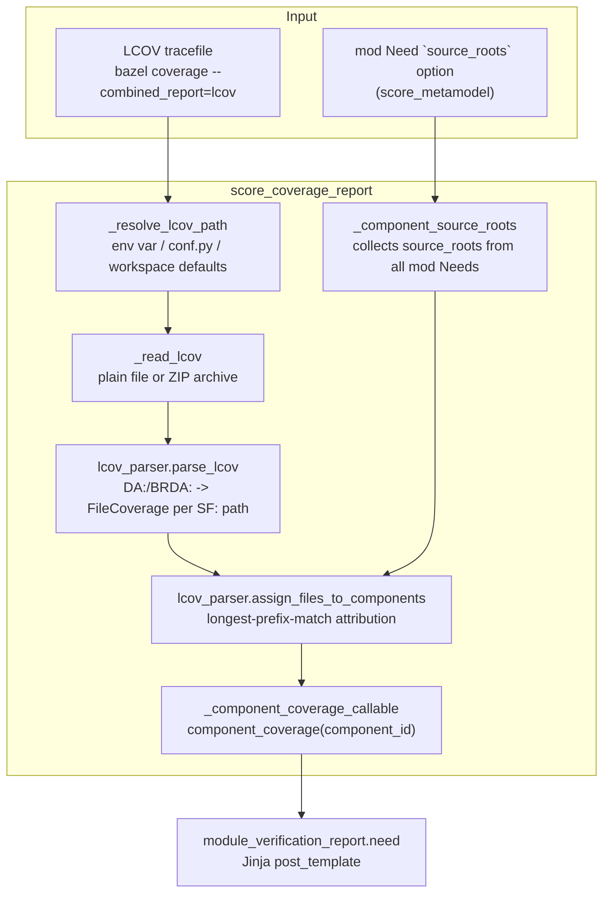

<!-- ----------------------------------------------------------------------------
  Copyright (c) 2026 Contributors to the Eclipse Foundation

  See the NOTICE file(s) distributed with this work for additional
  information regarding copyright ownership.

  This program and the accompanying materials are made available under the
  terms of the Apache License Version 2.0 which is available at
  https://www.apache.org/licenses/LICENSE-2.0

  SPDX-License-Identifier: Apache-2.0
----------------------------------------------------------------------------- -->

# `score_coverage_report`

This Sphinx extension feeds per-component LCOV coverage data into the
`module_verification_report` Sphinx-Needs post-template. It reads a single
LCOV tracefile (produced by whatever coverage tool the consuming repository
already uses, e.g. `bazel coverage`), attributes each source file to the
`comp` Need that owns it, and exposes the result to Jinja templates through a
`component_coverage(component_id)` render-context callable.

## Why this exists

`module_verification_report` renders a "Test Coverage" section per component,
which was previously a static placeholder. Coverage data only exists once
tests have *run*, so a docs build cannot declare the tracefile as a Bazel
input without pulling the whole test suite into its dependency graph. This
extension therefore resolves the tracefile lazily, at Sphinx build time, and
degrades gracefully (empty tables, not a build failure) whenever the file is
missing.

Which files belong to which component is likewise not something the
directory layout or the Bazel graph can answer reliably -- components nest,
and several may share one documentation bundle. Component boundaries are an
architectural decision, so they are declared next to the `includes` list that
already defines a module's scope, via the optional `source_roots` option on
`mod` Needs (see `score_metamodel`'s `metamodel.yaml`).

## Architecture overview

### Lifecycle and module-global state

The extension hooks into two Sphinx-Needs/Sphinx lifecycle events and keeps
its intermediate results in process-local module globals rather than instance
state, mirroring the pattern used by `score_sphinx_needs_templates`'s
`_LinkedNeeds`: the render-context callable registered in
`needs_render_context` must stay a plain, picklable top-level instance, so it
cannot carry per-build state itself.

* `builder-inited` &rarr; `_capture_coverage_config`: resolves and parses the
  LCOV tracefile once per build, storing the per-file result in
  `_coverage_by_file` and the `BuildEnvironment` in `_build_environment`.
* `env-updated` &rarr; `_invalidate_component_coverage` (priority `100`, i.e.
  before `score_sphinx_needs_templates`'s handler on the same event): drops
  the cached `_coverage_by_component` attribution.

`module_verification_report` carries the `render-after-needs-collection`
marker, so it is rendered twice: once while documents are read (when a
parallel worker may not yet see every `mod` Need) and once more after Need
environments are merged. Invalidating the attribution cache on `env-updated`
ensures the second rendering pass attributes coverage using the complete set
of Needs, while still reusing the (expensive, I/O-bound) parsed tracefile
from `_coverage_by_file`.

### Locating the tracefile

`_resolve_lcov_path` picks the LCOV file with the following precedence,
mirroring how `score_source_code_linker` wires `SCORE_SOURCELINKS`:

1. `SCORE_COVERAGE_LCOV` environment variable -- intended for a Bazel rule to
   inject a `$(location ...)`-expanded path.
2. `score_coverage_lcov_path` in `conf.py` -- a plain path, convenient for
   local/direct Sphinx builds.
3. Nothing configured: a tracefile found under the workspace-relative
   `coverage-report/` directory (`DEFAULT_COVERAGE_DIR`), else
   `bazel-out/_coverage/_coverage_report.dat` (`DEFAULT_LCOV_PATH`), which is
   where `bazel coverage --combined_report=lcov` already leaves its output.
   Both defaults require `BUILD_WORKSPACE_DIRECTORY` (i.e. `bazel run`); under
   a sandboxed `bazel build` neither resolves, and the extension logs and
   skips coverage instead of failing the build.

A relative configured path is resolved against the Bazel workspace root
(`find_ws_root()`, from `src/helper_lib`) when one is known, and used as-is
otherwise.

### Reading the tracefile

`_read_lcov` sniffs the file content rather than trusting its extension: a
report generator (e.g. `score_coverage`) may bundle the HTML, text and LCOV
renderings into a single ZIP archive under the configured/default name. If
the file is a ZIP, the extension reads `lcov_report/lcov.dat` if present, else
the first archive member with a `.dat`/`.info`/`.lcov` suffix, entirely in
memory (nothing is unpacked to disk).

### Parsing (`lcov_parser.py`)

`parse_lcov` turns LCOV tracefile text into `FileCoverage` records keyed by
the `SF:` path, independent of the tool that produced it (`llvm-cov`, `gcov`,
`grcov`, ...). Per-file totals are recomputed from `DA:`/`BRDA:` record lines
rather than trusted from the optional `LF`/`LH`/`BRF`/`BRH` summary lines,
since producers are inconsistent about emitting those.

### Attributing files to components

`_component_source_roots` walks every `mod` Need in the Sphinx-Needs graph and
parses its `source_roots` option body (one `<comp-id>: <path>` pair per
line) via `_parse_source_roots`, which skips malformed lines with a warning
rather than failing the build.

`assign_files_to_components` then attributes each `FileCoverage` to at most
one component: roots are matched as path prefixes (`_matches_prefix`, which
tolerates both repo-relative and absolute/sandboxed `SF:` paths), and the
*longest* matching root wins so that a nested child component claims its own
files instead of an ancestor also counting them. A component with no matching
root, or no Need declaring it, simply reports no coverage -- callers can tell
"no data available" apart from "0% covered".

### Consumption from templates

`_ComponentCoverage.__call__` (registered as `component_coverage` in
`needs_render_context`) lazily computes and caches the
component-to-`ComponentCoverage` mapping on first use per build/invalidation
cycle. `module_verification_report.need` calls
`component_coverage(component_id)` to render the per-component line/branch
coverage pie charts and the per-file coverage table.

## Public surface

* `setup(app)` -- the Sphinx extension entry point. Registers the
  `score_coverage_lcov_path` config value, the `component_coverage`
  render-context callable, and the two lifecycle hooks described above.

Everything else (`_resolve_lcov_path`, `_read_lcov`, `_load_coverage`,
`_parse_source_roots`, `_component_source_roots`, `_ComponentCoverage`,
`lcov_parser.parse_lcov`, `lcov_parser.assign_files_to_components`, ...) is an
internal implementation detail, covered directly by the unit tests in
`tests/`.
